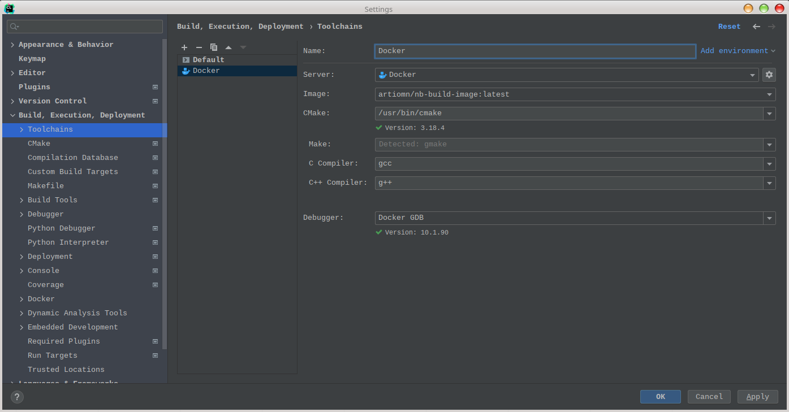
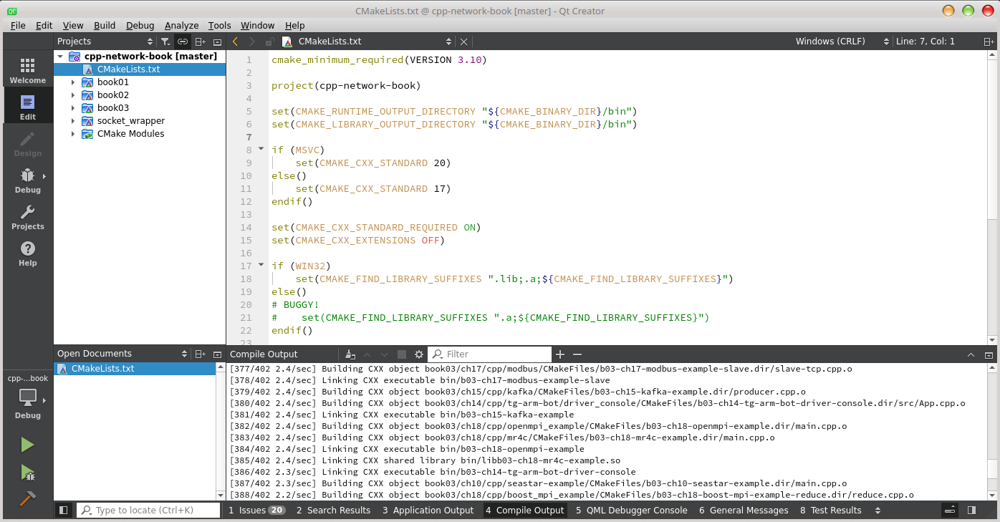

# Repository with a code for the "Network Programming" book

This repository contains the programming examples for the book "Network Programming"

## Table of contents

- [Beginning](#beginning)
- [FAQ](#faq)
  - [Is here all code without bugs?](#is-here-all-code-without-bugs)
  - [Why am I banned?](#why-am-i-banned)
  - [Do I need update?](#do-i-need-update)
  - [How to build examples?](#how-to-build-examples)
  - [What to do if build failed?](#build-failed)
  - [Why do you use Linux?](#why-do-you-use-linux)
  - [Can I build the examples under Windows?](#can-i-build-the-examples-under-windows)
  - [What can I read about CMake?](#what-can-i-read-about-cMake)
  - [Docker - what's it?](#docker---whats-it)
    - [How to use Docker?](#how-to-use-docker)
    - [Why can I run build only under root user?](#why-can-i-run-build-only-under-root-user)
    - [Can I build in the IDE?](#can-i-build-in-the-ide)
    - [I can't connect to Docker or IDE doesn't see this?](#i-cant-connect-to-docker-or-ide-doesnt-see-this)
    - [Something absent in the build image](#something-absent-in-the-build-image)
    - [Can I damage my system, when I works in the Docker environment?](#can-i-damage-my-system-when-i-works-in-the-docker-environment)
  - [How to run examples?](#how-to-run-examples)
  - [How to run console?](#how-to-run-console)
  - [How to update Docker image?](#how-to-update-docker-image)
  - [Where to download Netcat under Windows?](#where-to-download-netcat-under-windows)
  - [I'm doing all right, but something is not connected](#im-doing-all-right-but-something-is-not-connected)
  - [I've found error in the code, how can I fix it?](#ive-found-error-in-the-code-how-can-i-fix-it)
- [For contributors](#for-contributors)
- [Authors contacts](#authors-contacts)
- [Where is the answers can be downloaded?](#where-is-the-answers-can-be-downloaded)

## Beginning

To start work:

- If [Docker](https://www.docker.com/) was not installed, [install it](#how-to-use-docker).
- Если [Git](https://git-scm.com/) не установлен в системе, [установите его](https://git-scm.com/book/en/v2/Getting-Started-Installing-Git).
- Clone repository: `git clone https://github.com/artiomn/network-programming-book-code.git`.
  **Attention: clone repository in the directory with path contains only latin symbols!**
- Go to directory `network-programming-book-code`.
- Run script `./build_dockerized.sh`

If this is the first run, build will consume significant time.

To use QtCreator in the directory `network-programming-book-code` run the following command: `./run -q`.
IDE will started, then you need to open file as a project `CMakeLists.txt` in the directory `/home/developer/src` or `/usr/src/gb/src`.
The first directory is a symlink.

## FAQ

### Is here all code without bugs?

Vice versa. Errors exist. The book is a large project, and errors are inevitable.

Therefore, if you noticed an error, [open Issue](https://github.com/artiomn/network-programming-book-code/issues).
Also you can open issues for the errors in the book's text. If necessary erratum will be published.

[ToC ⮐](#table-of-contents)

### Why am I banned?

There are some things that obviously don't belong in a code repository for a book.
For example, politics. Want to get your point across? Do it in the Telegram channel chat. We'll ban you there much faster.

Beyond the obvious, there are things that not all **beginner** developers understand.

For example:

- Attempting to request with solutions for tasks in this repository. After that, you will be blocked immediately. Without personal explanations of why you can't do this.
- Attempting to "attack" with claims against authors who "owe you". This is more about things that are obvious to most people.
  We sell you a book: you pay, the store provides it to you. This is where our agreement ends, and we don't owe you anything anymore (including advertising is not a public offer).
  Everything else is done at the discretion of the authors.

[ToC ⮐](#table-of-contents)

### Do I need update?

Sometimes - it is necessary. Changes may be made to the code or image.
If you are working with a Git repository, the code is updated as follows:

```
git pull
```

Docker images can be updated with the following commands:

```
artiomn/gb-build-image
artiomn/gb-qt-creator-image
```

[ToC ⮐](#table-of-contents)

### How to build examples?

The build is performed using CMake, therefore:

- You can use any modern IDE for the build.
- The `./build.sh` script.
- Direct CMake launch.

The build does not load dependencies automatically.
In order to build without having to deal with installing multiple packages, a prepared environment is used.
It is a Docker container, the image of which [is on docker.hub](https://hub.docker.com/r/artiomn/nb-build-image).
The build in it is launched via the `./build_dockerized.sh` script.

Under Windows, the build was checked on MSVS 2019 or MSVS 2022 and the built artifacts will be in `src\out\build\windows-default\bin`.
Not everything will be built under Windows, there are some examples only for Linux.

[ToC ⮐](#table-of-contents)

### Build failed

There may be several reasons why the build fails.
First, make sure that you have:

- Docker is [configured and running correctly](#how-to-use-docker).
- If this is the first build, there is Internet access.

Next, check that the directory in which the build is performed does not contain non-Latin characters, spaces, or special characters in the path.

**Don't make a directory like**: `~/Общедоступные/user/Пользователь\Артём/*Network Programming BOOK & Code*/本の宿題/Репозиторий?!/network-programming-book-code`.

For **most builds** - this is a direct way to problems that the authors of the book and CMake developers did not know about.

<details>
  <summary>In this directory build failed too.</summary>
<pre>
~/Общедоступные/user/Пользователь\Артём/*Network Programming BOOK & Code*/本の宿題/Репозиторий?!/network-programming-book-code:master ✓ ➭ ./build.sh
CMake Error: The source directory "/home/artiom/Общедоступные/user/Пользователь/Артём/*Network Programming BOOK & Code*/本の宿題/Репозиторий?!/network-programming-book-code/src" does not exist.
Specify --help for usage, or press the help button on the CMake GUI.
Error: /home/artiom/Общедоступные/user/Пользователь/Артём/*Network Programming BOOK & Code*/本の宿題/Репозиторий?!/network-programming-book-code/build is not a directory
</pre>

But the build in the Docker-container will work even from here.

</details>

Put the repository in a directory with a normal name, for example `~/projects/cpp-network-tasks`.

If you have already built the project locally and want to build it in Docker or, conversely, built it in Docker and want to build locally, CMake will return an error similar to the following:

```
CMake Error: The current CMakeCache.txt directory /home/user/projects/cpp-network-tasks/build/CMakeCache.txt is different than the directory /usr/src/gb/build where CMakeCache.txt was created. This may result in binaries being created in the wrong place. If you are not sure, reedit the CMakeCache.txt
CMake Error: The source "/home/artiom/user/cpp-network-tasks/src/CMakeLists.txt" does not match the source "/usr/src/gb/src/CMakeLists.txt" used to generate cache.  Re-run cmake with a different source directory.
```

Which means that your CMake configurations are different, you are running it in a different environment.

To fix this, **delete the `build` directory** and run the build again:

```
➭ rm -rf build && ./build_dockerized.sh
```

[ToC ⮐](#table-of-contents)

### Why do you use Linux?

- Because most network applications work on Linux and BSD systems.
- The authors of the books use Linux.
- There are many other operating systems besides Linux, and it is impossible to consider the features of each.
- Translation of the code to Windows is agreed upon.
- If possible, the code is already cross-platform.

[ToC ⮐](#table-of-contents)

### Can I build the examples under Windows?

Yes, it is possible to build part of the code. The build was checked on MS Visual Studio 2019 and 2022.
To build the code, you need to open the root CMakeLists.txt as a CMake project.

But there are the following problems:

- There is code specific to Linux, for example, a call interceptor that will only build and run on this platform.
- Some code was simply not adapted for Windows, and its build is disabled.
- There are rare examples that build, but will not work correctly (one of these is an asynchronous server on `select()`).
- Windows does not have all the libraries, and CMake does not have, for example, a module for searching for Qt if Qt is not installed.
  This leads to the fact that the example not only cannot be built if something is missing, but the build fails.
  Of course, it is possible to fix this if you think it is necessary, the repository is open for edits.

Also, there is some Windows-specific code.

[ToC ⮐](#table-of-contents)

### What can I read about CMake?

There are:

- [YouTube tutorials](https://www.youtube.com/watch?v=SM3Klt2rY8g&list=PL6x9Hnsyqn2UwWjSvjCzAY6sEOBrHY7VH).
- [Documentation](https://cmake.org/documentation/).
- [Articles](https://cliutils.gitlab.io/modern-cmake/README.html)
- Lots of information on the Internet.

[ToC ⮐](#table-of-contents)

### Docker - what's it?

It is assumed that you will use Internet search while working with the book.
Accordingly, [Google will help](https://google.com/?q=Docker).
In short, [Docker](https://en.wikipedia.org/wiki/Docker) is one of the options for implementing containerization infrastructure automation.
It allows you to isolate applications in containers, the images of which are downloaded from the repository.
Here it is needed so that:

- You can build the code without installing unnecessary libraries in the your system.
- You can check the build with the same compiler as the authors.

We remind you that the image with instructions [is on Docker.hub](https://hub.docker.com/r/artiomn/nb-build-image).

[ToC ⮐](#table-of-contents)

#### How to use Docker?

On Windows only [with the Linux subsystem](https://docs.microsoft.com/en-us/windows/wsl/install).
On Linux it needs to be installed, and how depends on your distribution.
For example, in deb-based it is done [according to the following instructions](https://docs.docker.com/engine/install/debian/).

[ToC ⮐](#table-of-contents)

#### Why can I run build only under root user?

Only specific users can manage Docker, including starting or stopping containers:

- The `root` user.
- Users in the `docker` group.

You can add your user to the Docker group in different ways. One option that will work for many distributions:

```
$ sudo usermod -a -G docker "${USER}"
```

After that, you need to end the session, for example, exit to the Login Screen, and log in again.

[ToC ⮐](#table-of-contents)

#### Can I build in the IDE?

It depends on the IDE. It is possible to use remote build via SSH (the server is installed in the image), some IDEs, such as CLion, support working with Docker directly.

[ToC ⮐](#table-of-contents)

##### CLion

An example of CLion setup is shown [here](https://blog.jetbrains.com/clion/2021/10/clion-2021-3-eap-new-docker-toolchain/).

The Docker configuration settings are shown in the screenshot:



CMake configuration settings:


[ToC ⮐](#table-of-contents)

##### QtCreator

Previously, QtCreator did not support [remote build via SSH](https://stackoverflow.com/questions/42880004/with-qtcreator-how-can-i-build-my-project-on-a-remote-server-i-have-ssh-access).

There is a configuration option [with mounting a directory via SSHFS](https://forum.qt.io/topic/9928/qt-creator-remote-development-via-ssh-for-desktop-projects).
But all paths to the includes, as well as libraries, will naturally be incorrect, since they are different in the container.

Perhaps the simplest option is to install QtCreator in a container and run it from there.
At the moment, an image has been [built](https://hub.docker.com/r/artiomn/gb-qt-creator-image) for this.
To run it, use:

```
./run -q
```



[ToC ⮐](#table-of-contents)

#### I can't connect to Docker or IDE doesn't see this

Check if:

- Do you have Docker installed. If not, [install](https://docs.docker.com/engine/install/).
- Do your user have enough rights to interact with Docker.

In most distributions, Docker creates a `docker` group during installation, which you can check by running the following command:

```
$ grep docker /etc/group
docker:x:997:
```

It is clear that the user is not in this group.
Add him there:

```
$ sudo usermod -a -G docker "$USER"
```

```
$ grep docker /etc/group
docker:x:997:artiom
```

After relogin the group will shown:

```
$ groups
sys network power video storage lp input audio wheel artiom docker
```

[ToC ⮐](#table-of-contents)

#### Something absent in the build image

The image may be out of date.
Just [update it](how-to-update-docker-image).

[ToC ⮐](#table-of-contents)

### Can I damage my system, when I works in the Docker environment?

Yes, you can. The container is launched in privileged mode.
That is, it is possible to create devices from it, which means you can ruin anything.
This is required so that networks can create a TUN devices.

[ToC ⮐](#table-of-contents)

### How to run examples?

If you built as described above, the built binaries will be in the `build/bin` directory.
You can run them directly, but due to missing dependencies in the system, not everything may work.
Therefore, the launch is also performed in a container, using the `./run` command, which is passed the arguments required by the application and the path to it.

Example:

```cmd
➭ ./run sudo ./build/bin/b01-ch04-ping-from-root google.com
Pinging "google.com" [142.250.113.113]
Raw socket was created...
Starting to send packets...
TTL = 255
Recv timeout seconds = 1
Recv timeout microseconds = 0
Sending packet 0 to "google.com" request with id = 33
Receiving packet 0 from "google.com" response with id = 33, time = 159ms
Sending packet 1 to "google.com" request with id = 33
Receiving packet 1 from "google.com" response with id = 33, time = 160ms
```

[ToC ⮐](#table-of-contents)

### How to run console?

There are two options:

- `./run`
- `docker-compose run --rm nb` - for those who use docker-compose.

**Note:** the console is launched via the **`./run`** script in the root of the repository, **not** via `docker run`.

[ToC ⮐](#table-of-contents)

### How to update Docker image?

Using docker-compose.
In the project directory, you need to run:

```cmd
➭ docker-compose pull
```

Or with Docker:

```cmd
➭ docker pull "artiomn/nb-build-image"
```

[ToC ⮐](#table-of-contents)

### Where to download Netcat under Windows?

For example, [here](https://github.com/diegocr/netcat).

**Attention!**
Windows Defender may block Netcat, detecting it as Netcat.Hacktool.
In this case, just disable "real-time protection".

[ToC ⮐](#table-of-contents)

### I'm doing all right, but something is not connected

One of the developers had this problem. He found out that Netcat was connecting to an IPv6 address, while the server was listening only to IPv4.
How to fix it? Depends on the application. If possible, set the IPv4 address explicitly, rather than the domain name.
For Netcat, you can use the `-4` option (not all implementations support it).

[ToC ⮐](#table-of-contents)

### I've found error in the code, how can I fix it?

Yes. Following the usual Guthub process:

- First fork the repository.
- Clone it, fix the bug.
- Make a Pull request.

Or you can simply create an [Issue](https://github.com/artiomn/network-programming-book-code/issues/new/choose).
But in this case, we can't promise a quick fix.

[ToC ⮐](#table-of-contents)

## For contributors

There is a script `install_git_hooks.py` in the root directory, this script checks for the pre-commit tool installed, and if it is not, installs it.
pre-commit is a tool for automating checks and tests before committing changes to a Git repository.
It allows you to define a set of checks and scripts that should be executed before changes are committed to the repository.
Using pre-commit helps maintain code quality, reduces the likelihood of introducing errors, and simplifies collaboration.

To install it yourself, open a command prompt and enter:

```cmd
pip3 install pre-commit
```

Then go to the root repository `network-programming-book-code` and enter the command:

```cmd
pre-commit install --install-hooks
```

Next:

```cmd
pre-commit run
```

This command runs all tests required for commit.

For pre-commit to work correctly and check cpp files, you also need to install [cppcheck](https://github.com/danmar/cppcheck#visual-studio), the setup instructions are on the page itself, as well as in [this](https://cppcheck.sourceforge.io/manual.pdf) manual.

[ToC ⮐](#table-of-contents)

## Authors contacts

If you have something to say, [create an Issue](https://github.com/artiomn/network-programming-book-code/issues).
Or contact the [Telegram channel](https://t.me/net_progr) about the book.

[ToC ⮐](#table-of-contents)

## Where is the answers can be downloaded?

You can ask for the answers in the TG channel written above.

[ToC ⮐](#table-of-contents)
