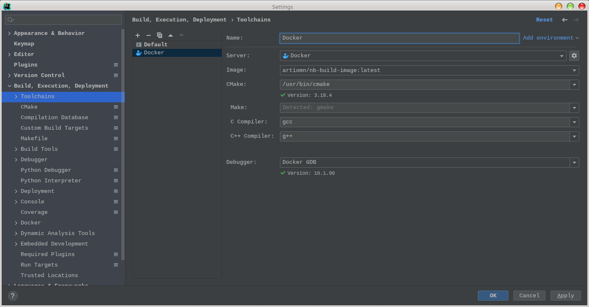
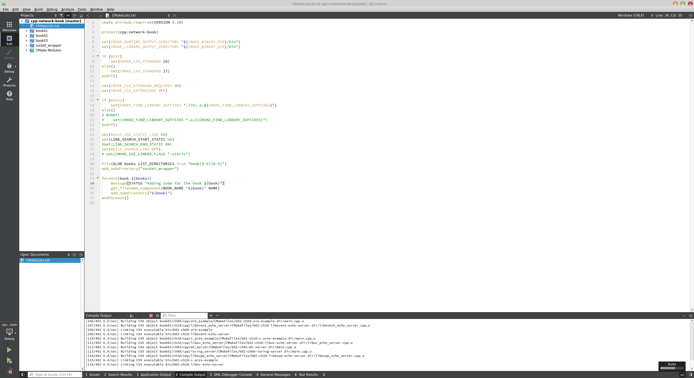

# Repository with a code for the "Network Programming" book

[](https://github.com/artiomn/network-programming-book-code/actions/workflows/cpp-linux-build.yml)
[](https://github.com/artiomn/network-programming-book-code/actions/workflows/cpp-windows-build.yml)
[](https://github.com/artiomn/network-programming-book-code/actions/workflows/docker-images-build.yml)

Код для книги "Сетевое программирование".

## Оглавление

- [Начало работы](#%D0%BD%D0%B0%D1%87%D0%B0%D0%BB%D0%BE-%D1%80%D0%B0%D0%B1%D0%BE%D1%82%D1%8B)
- [FAQ](#faq)
  - [У вас же тут всё идеально, точно без ошибок?](#%D1%83-%D0%B2%D0%B0%D1%81-%D0%B6%D0%B5-%D1%82%D1%83%D1%82-%D0%B2%D1%81%D1%91-%D0%B8%D0%B4%D0%B5%D0%B0%D0%BB%D1%8C%D0%BD%D0%BE-%D1%82%D0%BE%D1%87%D0%BD%D0%BE-%D0%B1%D0%B5%D0%B7-%D0%BE%D1%88%D0%B8%D0%B1%D0%BE%D0%BA)
  - [Почему меня забанили?](#%D0%BF%D0%BE%D1%87%D0%B5%D0%BC%D1%83-%D0%BC%D0%B5%D0%BD%D1%8F-%D0%B7%D0%B0%D0%B1%D0%B0%D0%BD%D0%B8%D0%BB%D0%B8)
  - [Надо ли обновляться и как?](#%D0%BD%D0%B0%D0%B4%D0%BE-%D0%BB%D0%B8-%D0%BE%D0%B1%D0%BD%D0%BE%D0%B2%D0%BB%D1%8F%D1%82%D1%8C%D1%81%D1%8F-%D0%B8-%D0%BA%D0%B0%D0%BA)
  - [Как собрать примеры?](#%D0%BA%D0%B0%D0%BA-%D1%81%D0%BE%D0%B1%D1%80%D0%B0%D1%82%D1%8C-%D0%BF%D1%80%D0%B8%D0%BC%D0%B5%D1%80%D1%8B)
  - [Сборка не проходит, вообще не собирается ничего.](#%D1%81%D0%B1%D0%BE%D1%80%D0%BA%D0%B0-%D0%BD%D0%B5-%D0%BF%D1%80%D0%BE%D1%85%D0%BE%D0%B4%D0%B8%D1%82-%D0%B2%D0%BE%D0%BE%D0%B1%D1%89%D0%B5-%D0%BD%D0%B5-%D1%81%D0%BE%D0%B1%D0%B8%D1%80%D0%B0%D0%B5%D1%82%D1%81%D1%8F-%D0%BD%D0%B8%D1%87%D0%B5%D0%B3%D0%BE)
  - [Почему используется Linux?](#%D0%BF%D0%BE%D1%87%D0%B5%D0%BC%D1%83-%D0%B8%D1%81%D0%BF%D0%BE%D0%BB%D1%8C%D0%B7%D1%83%D0%B5%D1%82%D1%81%D1%8F-linux)
  - [Могу ли я собрать код на Windows?](#%D0%BC%D0%BE%D0%B3%D1%83-%D0%BB%D0%B8-%D1%8F-%D1%81%D0%BE%D0%B1%D1%80%D0%B0%D1%82%D1%8C-%D0%BA%D0%BE%D0%B4-%D0%BD%D0%B0-windows)
  - [А есть что-то про CMake?](#%D0%B0-%D0%B5%D1%81%D1%82%D1%8C-%D1%87%D1%82%D0%BE-%D1%82%D0%BE-%D0%BF%D1%80%D0%BE-cmake)
  - [Docker - что это?](#docker---%D1%87%D1%82%D0%BE-%D1%8D%D1%82%D0%BE)
    - [Как использовать Docker?](#%D0%BA%D0%B0%D0%BA-%D0%B8%D1%81%D0%BF%D0%BE%D0%BB%D1%8C%D0%B7%D0%BE%D0%B2%D0%B0%D1%82%D1%8C-docker)
    - [У меня сборка только под суперпользователем (root) запускается, почему?](#%D1%83-%D0%BC%D0%B5%D0%BD%D1%8F-%D1%81%D0%B1%D0%BE%D1%80%D0%BA%D0%B0-%D1%82%D0%BE%D0%BB%D1%8C%D0%BA%D0%BE-%D0%BF%D0%BE%D0%B4-%D1%81%D1%83%D0%BF%D0%B5%D1%80%D0%BF%D0%BE%D0%BB%D1%8C%D0%B7%D0%BE%D0%B2%D0%B0%D1%82%D0%B5%D0%BB%D0%B5%D0%BC-root-%D0%B7%D0%B0%D0%BF%D1%83%D1%81%D0%BA%D0%B0%D0%B5%D1%82%D1%81%D1%8F-%D0%BF%D0%BE%D1%87%D0%B5%D0%BC%D1%83)
    - [Могу ли я собирать в IDE?](#%D0%BC%D0%BE%D0%B3%D1%83-%D0%BB%D0%B8-%D1%8F-%D1%81%D0%BE%D0%B1%D0%B8%D1%80%D0%B0%D1%82%D1%8C-%D0%B2-ide)
    - [Не могу подключиться к Docker либо IDE его не видит, что делать?](#%D0%BD%D0%B5-%D0%BC%D0%BE%D0%B3%D1%83-%D0%BF%D0%BE%D0%B4%D0%BA%D0%BB%D1%8E%D1%87%D0%B8%D1%82%D1%8C%D1%81%D1%8F-%D0%BA-docker-%D0%BB%D0%B8%D0%B1%D0%BE-ide-%D0%B5%D0%B3%D0%BE-%D0%BD%D0%B5-%D0%B2%D0%B8%D0%B4%D0%B8%D1%82-%D1%87%D1%82%D0%BE-%D0%B4%D0%B5%D0%BB%D0%B0%D1%82%D1%8C)
    - [В образе чего-то не хватает.](#%D0%B2-%D0%BE%D0%B1%D1%80%D0%B0%D0%B7%D0%B5-%D1%87%D0%B5%D0%B3%D0%BE-%D1%82%D0%BE-%D0%BD%D0%B5-%D1%85%D0%B2%D0%B0%D1%82%D0%B0%D0%B5%D1%82)
    - [Работая в Docker я не могу испортить систему?](#%D1%80%D0%B0%D0%B1%D0%BE%D1%82%D0%B0%D1%8F-%D0%B2-docker-%D1%8F-%D0%BD%D0%B5-%D0%BC%D0%BE%D0%B3%D1%83-%D0%B8%D1%81%D0%BF%D0%BE%D1%80%D1%82%D0%B8%D1%82%D1%8C-%D1%81%D0%B8%D1%81%D1%82%D0%B5%D0%BC%D1%83)
    - [Как обновить Docker образ?](#%D0%BA%D0%B0%D0%BA-%D0%BE%D0%B1%D0%BD%D0%BE%D0%B2%D0%B8%D1%82%D1%8C-docker-%D0%BE%D0%B1%D1%80%D0%B0%D0%B7)
  - [Как запустить собранное?](#%D0%BA%D0%B0%D0%BA-%D0%B7%D0%B0%D0%BF%D1%83%D1%81%D1%82%D0%B8%D1%82%D1%8C-%D1%81%D0%BE%D0%B1%D1%80%D0%B0%D0%BD%D0%BD%D0%BE%D0%B5)
  - [Как запустить консоль?](#%D0%BA%D0%B0%D0%BA-%D0%B7%D0%B0%D0%BF%D1%83%D1%81%D1%82%D0%B8%D1%82%D1%8C-%D0%BA%D0%BE%D0%BD%D1%81%D0%BE%D0%BB%D1%8C)
  - [Где взять Netcat под Windows?](#%D0%B3%D0%B4%D0%B5-%D0%B2%D0%B7%D1%8F%D1%82%D1%8C-netcat-%D0%BF%D0%BE%D0%B4-windows)
  - [Всё делаю правильно, но что-то не подключается.](#%D0%B2%D1%81%D1%91-%D0%B4%D0%B5%D0%BB%D0%B0%D1%8E-%D0%BF%D1%80%D0%B0%D0%B2%D0%B8%D0%BB%D1%8C%D0%BD%D0%BE-%D0%BD%D0%BE-%D1%87%D1%82%D0%BE-%D1%82%D0%BE-%D0%BD%D0%B5-%D0%BF%D0%BE%D0%B4%D0%BA%D0%BB%D1%8E%D1%87%D0%B0%D0%B5%D1%82%D1%81%D1%8F)
  - [Я нашёл ошибку в коде, могу ли я её исправить?](#%D1%8F-%D0%BD%D0%B0%D1%88%D1%91%D0%BB-%D0%BE%D1%88%D0%B8%D0%B1%D0%BA%D1%83-%D0%B2-%D0%BA%D0%BE%D0%B4%D0%B5-%D0%BC%D0%BE%D0%B3%D1%83-%D0%BB%D0%B8-%D1%8F-%D0%B5%D1%91-%D0%B8%D1%81%D0%BF%D1%80%D0%B0%D0%B2%D0%B8%D1%82%D1%8C)
- [Для контрибьютеров](#%D0%B4%D0%BB%D1%8F-%D0%BA%D0%BE%D0%BD%D1%82%D1%80%D0%B8%D0%B1%D1%8C%D1%8E%D1%82%D0%B5%D1%80%D0%BE%D0%B2)
- [Контакты с авторами](#%D0%BA%D0%BE%D0%BD%D1%82%D0%B0%D0%BA%D1%82%D1%8B-%D1%81-%D0%B0%D0%B2%D1%82%D0%BE%D1%80%D0%B0%D0%BC%D0%B8)

## Начало работы

Чтобы начать работать:

- Если [Docker](https://www.docker.com/) не установлен в системе, [установите его](#%D0%BA%D0%B0%D0%BA-%D0%B8%D1%81%D0%BF%D0%BE%D0%BB%D1%8C%D0%B7%D0%BE%D0%B2%D0%B0%D1%82%D1%8C-docker).
- Если [Git](https://git-scm.com/) не установлен в системе, [установите его](https://git-scm.com/book/ru/v2/%D0%92%D0%B2%D0%B5%D0%B4%D0%B5%D0%BD%D0%B8%D0%B5-%D0%A3%D1%81%D1%82%D0%B0%D0%BD%D0%BE%D0%B2%D0%BA%D0%B0-Git).
- Склонируйте репозиторий: `git clone https://github.com/artiomn/network-programming-book-code.git`.
  **Внимание: склонируйте репозиторий в каталог, содержащий только латинские символы в пути!**
- Зайдите в каталог `network-programming-book-code`.
- Запустите скрипт `./build_dockerized.sh`

Если это первый запуск, пройдёт значительное время перед тем, как вы получите результат.

Для запуска IDE QtCreator выполните из каталога `network-programming-book-code` следующую команду: `./run -q`.
Будет запущена IDE, в которой необходимо открыть, как проект, файл `CMakeLists.txt` в каталоге `/home/developer/src` или `/usr/src/gb/src` (первый каталог - ссылка).

## FAQ

### У вас же тут всё идеально, точно без ошибок?

Наоборот. Почти наверняка здесь есть ошибки.
Книга - большой проект. Их появление неизбежно. Поэтому, если вы заметили ошибку, [смело заводите Issue](https://github.com/artiomn/network-programming-book-code/issues).
Аналогично вы можете заводить issue с ошибками в тексте книги, и если потребуется, будет выпущен соответствующий erratum.
Предложения также приветствуются.

[К оглавлению ⮐](#%D0%BE%D0%B3%D0%BB%D0%B0%D0%B2%D0%BB%D0%B5%D0%BD%D0%B8%D0%B5)

### Почему меня забанили?

Есть некоторые очевидные для большинства людей вещи, которые не к месту в репозитории кода для книги.
Например, политика. Хотите донести своё мнение? Сделайте это в чате Telegram канала. Там мы забаним вас гораздо быстрее.

Помимо очевидного, есть то, что не все **начинающие** разработчики понимают.
Например:

- Попытка реквестов с решениями заданий в этот репозиторий. После этого вы будете заблокированы немедленно. Без персональных объяснений, почему так делать нельзя.
- Попытка "наездов" с претензиями к авторам, которые "вам должны". Это больше относится к очевидным для большинства людей вещам. Мы вам продаём книгу: вы платите, магазин вам её предоставляет. На этом наш договор оканчивается, и мы вам больше не должны ничего (в т.ч. реклама не является публичной офертой). Всё остальное делается по доброй воле авторов.

[К оглавлению ⮐](#%D0%BE%D0%B3%D0%BB%D0%B0%D0%B2%D0%BB%D0%B5%D0%BD%D0%B8%D0%B5)

### Надо ли обновляться и как?

Иногда - надо. В код или образ могут вноситься изменения.
Если вы работаете с Git репозиторием, код обновляется следующим образом:

```cmd
git pull
```

Docker образы тоже [могут потребовать обновления](#%D0%BA%D0%B0%D0%BA-%D0%BE%D0%B1%D0%BD%D0%BE%D0%B2%D0%B8%D1%82%D1%8C-docker-%D0%BE%D0%B1%D1%80%D0%B0%D0%B7).

[К оглавлению ⮐](#%D0%BE%D0%B3%D0%BB%D0%B0%D0%B2%D0%BB%D0%B5%D0%BD%D0%B8%D0%B5)

### Как собрать примеры?

Сборка производится, используя CMake, поэтому:

- Вы можете использовать любую современную IDE для сборки.
- Скрипт `./build.sh`.
- Прямой запуск CMake.

Сборка не подгружает зависимости автоматически.
Поэтому, для того, чтобы собрать без необходимости заниматься установкой множества пакетов, используется подготовленная среда.
Она представляет собой Docker-контейнер, образ которого [лежит на docker.hub](https://hub.docker.com/r/artiomn/nb-build-image).
Сборка в ней запускается через скрипт `./build_dockerized.sh`.

Под Windows сборка была проверена на MSVS 2019 bkb MSVS 2022, и собранные артефакты будут находиться в `src\out\build\windows-default\bin`.
Собираться под Windows будет не всё, есть примеры только под Linux.

[К оглавлению ⮐](#%D0%BE%D0%B3%D0%BB%D0%B0%D0%B2%D0%BB%D0%B5%D0%BD%D0%B8%D0%B5)

### Сборка не проходит, вообще не собирается ничего

Может быть несколько причин из-за которых не проходит сборка.
Для начала, убедитесь, что у вас:

- Правильно [настроен и работает Docker](#%D0%BA%D0%B0%D0%BA-%D0%B8%D1%81%D0%BF%D0%BE%D0%BB%D1%8C%D0%B7%D0%BE%D0%B2%D0%B0%D1%82%D1%8C-docker).
- Если это первая сборка, есть доступ в Интернет.

Далее, проверьте, что каталог в котором производится сборка, не содержит в пути не латинских символов, пробелов и спецсимволов.

**Не делайте каталог вида**: `~/Общедоступные/user/Пользователь\Артём/*Network Programming BOOK & Code*/本の宿題/Репозиторий?!/network-programming-book-code`.
Для **большинства сборок** - это верный путь к проблемам, о которых не знали авторы книги и разработчики CMake.

<details>
  <summary>Конкретно в этом каталоге тоже не собирается.</summary>
<pre>
~/Общедоступные/user/Пользователь\Артём/*Network Programming BOOK & Code*/本の宿題/Репозиторий?!/network-programming-book-code:master ✓ ➭ ./build.sh
CMake Error: The source directory "/home/artiom/Общедоступные/user/Пользователь/Артём/*Network Programming BOOK & Code*/本の宿題/Репозиторий?!/network-programming-book-code/src" does not exist.
Specify --help for usage, or press the help button on the CMake GUI.
Error: /home/artiom/Общедоступные/user/Пользователь/Артём/*Network Programming BOOK & Code*/本の宿題/Репозиторий?!/network-programming-book-code/build is not a directory
</pre>

Но сборка в Docker-контейнере будет работать и отсюда.

</details>

Положите репозиторий в каталог с нормальным именем, например `~/projects/cpp-network-tasks`.

Если вы уже собирали проект локально и хотите собрать его в Docker или, наоборот, собирали в Docker и хотите собрать локально, CMake выдаст ошибку, похожую на следующую:

```cmd
CMake Error: The current CMakeCache.txt directory /home/user/projects/cpp-network-tasks/build/CMakeCache.txt is different than the directory /usr/src/gb/build where CMakeCache.txt was created. This may result in binaries being created in the wrong place. If you are not sure, reedit the CMakeCache.txt
CMake Error: The source "/home/artiom/user/cpp-network-tasks/src/CMakeLists.txt" does not match the source "/usr/src/gb/src/CMakeLists.txt" used to generate cache.  Re-run cmake with a different source directory.
```

Что говорит о том, что конфигурации CMake различаются, вы запускаете его в разном окружении.

Чтобы исправить это, **удалите каталог `build`** и запустите сборку заново:

```cmd
➭ rm -rf build && ./build_dockerized.sh
```

[К оглавлению ⮐](#%D0%BE%D0%B3%D0%BB%D0%B0%D0%B2%D0%BB%D0%B5%D0%BD%D0%B8%D0%B5)

### Почему используется Linux?

- Потому что, на Linux и BSD системах работают большинство сетевых приложений.
- Linux используют авторы.
- Кроме Linux есть множество других ОС, и рассмотреть особенности каждой невозможно.
- Перевод кода на Windows оговорён.
- По возможности, код и так кроссплатформенный.

[К оглавлению ⮐](#%D0%BE%D0%B3%D0%BB%D0%B0%D0%B2%D0%BB%D0%B5%D0%BD%D0%B8%D0%B5)

### Могу ли я собрать код на Windows?

Да, возможно собрать часть кода. Сборка проверялась на MS Visual Studio 2019 и 2022.
Подробнее о поддержке CMake в MSVS, вы можете [прочитать у Microsoft](https://github.com/MicrosoftDocs/cpp-docs/blob/main/docs/build/cmake-projects-in-visual-studio.md).
Чтобы собрать код, надо открыть корневой CMakeLists.txt, как CMake проект.

Но есть следующие проблемы:

- Есть код специфичный для Linux, например перехватчик вызовов, который будет собираться и работать только на этой платформе.
- Некоторый код просто не был адаптирован для Windows, и его сборка выключена.
- Есть редкие примеры, которые собираются, но работать корректно не будут (один из таких - асинхронный сервер на `select()`).
- В Windows есть не все библиотеки, а CMake не имеет, например модуля для поиска Qt, если Qt не установлен.
  Это приводит к тому, что пример не просто нельзя собрать, если чего-то не хватает, а падает сборка.
  Конечно, возможно это исправить, если вы считаете, что нужно, репозиторий открыт для правок.
- Надо установить [Boost](https://sourceforge.net/projects/boost/files/boost-binaries/).

Также, есть некоторый код, специфичный для Windows.

[К оглавлению ⮐](#%D0%BE%D0%B3%D0%BB%D0%B0%D0%B2%D0%BB%D0%B5%D0%BD%D0%B8%D0%B5)

### А есть что-то про CMake?

Есть:

- [CGold: The Hitchhiker’s Guide to the CMake](https://cgold.readthedocs.io/en/latest/).
- [Уроки на Youtube](https://www.youtube.com/watch?v=SM3Klt2rY8g&list=PL6x9Hnsyqn2UwWjSvjCzAY6sEOBrHY7VH).
- [Документация](https://cmake.org/documentation/).
- Много информации в Интернете.

[К оглавлению ⮐](#%D0%BE%D0%B3%D0%BB%D0%B0%D0%B2%D0%BB%D0%B5%D0%BD%D0%B8%D0%B5)

### Docker - что это?

Предполагается, что в процессе работы с книгой, вы будете использовать поиск в Интернет.
Соответственно, [Google поможет](https://google.gik-team.com/?q=Docker).
Если очень кратко, [Docker](https://ru.wikipedia.org/wiki/Docker) - это один из вариантов реализации автоматизации инфраструктуры контейнеризации.
Он позволяет изолировать приложения в контейнерах, образы которых скачаны из репозитория.
Здесь он нужен для того, чтобы:

- Вы могли собрать код, не устанавливая лишних библиотек в рабочую систему.
- Вы могли проверить сборку тем же самым компилятором, что и авторы.

Напоминаем, что образ с инструкциями [лежит на Docker.hub](https://hub.docker.com/r/artiomn/nb-build-image).

[К оглавлению ⮐](#%D0%BE%D0%B3%D0%BB%D0%B0%D0%B2%D0%BB%D0%B5%D0%BD%D0%B8%D0%B5)

#### Как использовать Docker?

На Windows только [вместе с Linux подсистемой](https://docs.microsoft.com/en-us/windows/wsl/install).
На Linux его надо установить, а как, зависит от вашего дистрибутива.
Например, в deb-based это делается [по следующей инструкции](https://docs.docker.com/engine/install/debian/).

[К оглавлению ⮐](#%D0%BE%D0%B3%D0%BB%D0%B0%D0%B2%D0%BB%D0%B5%D0%BD%D0%B8%D0%B5)

#### У меня сборка только под суперпользователем (root) запускается, почему?

Управлять Docker, в том числе и запускать или останавливать контейнеры могут только:

- Пользователь `root`.
- Пользователи в группе `docker`.

Добавить вашего пользователя в группу Docker возможно по-разному. Один из вариантов, который будет работать для многих дистрибутивов:

```cmd
sudo usermod -a -G docker "${USER}"
```

После этого надо завершить сессию, например выйти на Login Screen, и снова войти.

[К оглавлению ⮐](#%D0%BE%D0%B3%D0%BB%D0%B0%D0%B2%D0%BB%D0%B5%D0%BD%D0%B8%D0%B5)

#### Могу ли я собирать в IDE?

Это зависит от IDE. Возможно использовать удалённую сборку по SSH (сервер установлен в образе), некоторые IDE, такие как CLion, поддерживают работу с Docker напрямую.

[К оглавлению ⮐](#%D0%BE%D0%B3%D0%BB%D0%B0%D0%B2%D0%BB%D0%B5%D0%BD%D0%B8%D0%B5)

##### CLion

Пример настройки CLion показан [здесь](https://blog.jetbrains.com/clion/2021/10/clion-2021-3-eap-new-docker-toolchain/).

Настройки конфигурации Docker показаны на скриншоте:



Настройки конфигурации CMake:


[К оглавлению ⮐](#%D0%BE%D0%B3%D0%BB%D0%B0%D0%B2%D0%BB%D0%B5%D0%BD%D0%B8%D0%B5)

##### QtCreator

Раньше QtCreator не поддерживал [удалённую сборку по SSH](https://stackoverflow.com/questions/42880004/with-qtcreator-how-can-i-build-my-project-on-a-remote-server-i-have-ssh-access).

Есть вариант настройки [с подмонтированием каталога через SSHFS](https://forum.qt.io/topic/9928/qt-creator-remote-development-via-ssh-for-desktop-projects).
Но все пути к инклудам, а также библиотекам, естественно, будут некорректны, т.к. в контейнере они другие.

Возможно самый просто вариант - установить QtCreator в контейнер и запустить оттуда.
На данный момент для этого [собран образ](https://hub.docker.com/r/artiomn/nb-qt-creator-image).
Чтобы запустить его, используйте:

```cmd
./run -q
```



[К оглавлению ⮐](#%D0%BE%D0%B3%D0%BB%D0%B0%D0%B2%D0%BB%D0%B5%D0%BD%D0%B8%D0%B5)

#### Не могу подключиться к Docker либо IDE его не видит, что делать?

Проверьте:

- Установлен ли у вас Docker. Если нет - [установите](https://docs.docker.com/engine/install/).
- Достаточно ли прав у вашего пользователя, что с Docker взаимодействовать.

В большинстве дистрибутивов, при установке Docker создаёт группу `docker`, что вы можете проверить, выполнив следующую команду:

```
$ grep docker /etc/group
docker:x:997:
```

Видно, что пользователя в этой группе нет.
Добавьте его туда:

```
$ sudo usermod -a -G docker "$USER"
```

```
$ grep docker /etc/group
docker:x:997:artiom
```

После того, как вы перелогинитесь в системе, группа будет видна:

```
$ groups
sys network power video storage lp input audio wheel artiom docker
```

[К оглавлению ⮐](#%D0%BE%D0%B3%D0%BB%D0%B0%D0%B2%D0%BB%D0%B5%D0%BD%D0%B8%D0%B5)

#### В образе чего-то не хватает

Возможно, образ устарел.
[Обновите его](#%D0%BA%D0%B0%D0%BA-%D0%BE%D0%B1%D0%BD%D0%BE%D0%B2%D0%B8%D1%82%D1%8C-docker-%D0%BE%D0%B1%D1%80%D0%B0%D0%B7).
Также, возможно, что это ошибка. Такое случается. В этом случае вы можете завести Issue.

[К оглавлению ⮐](#%D0%BE%D0%B3%D0%BB%D0%B0%D0%B2%D0%BB%D0%B5%D0%BD%D0%B8%D0%B5)

### Работая в Docker я не могу испортить систему?

Можете. Контейнер запускается в privileged режиме. Т.е. из него возможно создавать устройства, а значит испортить всё, что угодно.
Это требуется для того, чтобы сети могли создать TUN устройства.

[К оглавлению ⮐](#%D0%BE%D0%B3%D0%BB%D0%B0%D0%B2%D0%BB%D0%B5%D0%BD%D0%B8%D0%B5)

### Как запустить собранное?

Если вы производили сборку, как указано выше, собранные бинарные файлы будут находиться в каталоге `build/bin`.
Запустить вы их можете напрямую, однако из-за отсутствующих в системе зависимостей работать может не всё.
Поэтому, запуск также производится в контейнере, используя команду `./run`, которой передаются необходимые приложению аргументы и путь к нему.

Пример:

```cmd
➭ ./run sudo ./build/bin/b01-ch04-ping-from-root google.com
Pinging "google.com" [142.250.113.113]
Raw socket was created...
Starting to send packets...
TTL = 255
Recv timeout seconds = 1
Recv timeout microseconds = 0
Sending packet 0 to "google.com" request with id = 33
Receiving packet 0 from "google.com" response with id = 33, time = 159ms
Sending packet 1 to "google.com" request with id = 33
Receiving packet 1 from "google.com" response with id = 33, time = 160ms
```

[К оглавлению ⮐](#%D0%BE%D0%B3%D0%BB%D0%B0%D0%B2%D0%BB%D0%B5%D0%BD%D0%B8%D0%B5)

### Как запустить консоль?

Есть два варианта:

- `./run`
- `docker-compose run --rm nb` - для тех, кто пользуется docker-compose.

**Обратите внимание:** консоль запускается через **скрипт `./run`** в корне репозитория, **не** через `docker run`.

[К оглавлению ⮐](#%D0%BE%D0%B3%D0%BB%D0%B0%D0%B2%D0%BB%D0%B5%D0%BD%D0%B8%D0%B5)

## Как обновить Docker образ?

Через docker-compose.
В каталоге проекта нужно запустить:

```cmd
➭ docker-compose pull
```

Или через Docker:

```cmd
➭ docker pull "artiomn/nb-build-image"
```

[К оглавлению ⮐](#%D0%BE%D0%B3%D0%BB%D0%B0%D0%B2%D0%BB%D0%B5%D0%BD%D0%B8%D0%B5)

### Где взять Netcat под Windows?

Например, [здесь](https://github.com/diegocr/netcat). Либо написать самостоятельно. Ведь это книга по сетевому программированию.

**Внимание!**
Windows Defender может заблокировать Netcat, определив его, как Netcat.Hacktool.
В таком случае, просто отключите "защиту реального времени".

[К оглавлению ⮐](#%D0%BE%D0%B3%D0%BB%D0%B0%D0%B2%D0%BB%D0%B5%D0%BD%D0%B8%D0%B5)

### Всё делаю правильно, но что-то не подключается

Такая проблема была у одного разработчика. Он выяснил, что Netcat подключался на IPv6 адрес, тогда как сервер прослушивал только IPv4.
Как исправить? Зависит от приложения. Задайте ему не доменное имя, а IPv4 адрес явно, при возможности.
Для Netcat возможно использовать опцию `-4` (не все реализации её поддерживают).

[К оглавлению ⮐](#%D0%BE%D0%B3%D0%BB%D0%B0%D0%B2%D0%BB%D0%B5%D0%BD%D0%B8%D0%B5)

### Я нашёл ошибку в коде, могу ли я её исправить

Да. Следуя обычному процессу Guthub:

- Сначала делаете форк репозитория.
- Клонируете его, исправляете ошибку.
- Делаете Pull request.

Или просто можете просто завести [Issue](https://github.com/artiomn/network-programming-book-code/issues/new/choose).
Но, в этом случае, обещать быстрое исправление мы не можем.

[К оглавлению ⮐](#%D0%BE%D0%B3%D0%BB%D0%B0%D0%B2%D0%BB%D0%B5%D0%BD%D0%B8%D0%B5)

## Для контрибьюторов

В корневой директории имеется скрипт `install_git_hooks.py`, данный скрипт проверяет наличие установленного инструмента pre-commit, и, если его нет, устанавливает его. pre-commit - это инструмент для автоматизации проверок и тестов перед фиксацией (коммитом) изменений в репозитории Git. Он позволяет определить набор проверок и скриптов, которые должны быть выполнены перед тем, как изменения будут зафиксированы в репозитории. Использование pre-commit помогает поддерживать качество кода, уменьшает вероятность внесения ошибок и упрощает совместную работу.

Для самостоятельной установке необходимо открыть командную строку и ввести:

```cmd
pip3 install pre-commit
```

После чего перейти в корневой репозиторий `network-programming-book-code` и ввести команду:

```cmd
pre-commit install --install-hooks
```

Затем:

```cmd
pre-commit run
```

Эта команда запускает все тесты необходимые для коммита.

Для правильной работы pre-commit и проверки cpp файлов необходимо также установить [cppcheck](https://github.com/danmar/cppcheck#visual-studio), инструкция по настройке есть на самой странице, так же в [данном](https://cppcheck.sourceforge.io/manual.pdf) мануале.

[К оглавлению ⮐](#%D0%BE%D0%B3%D0%BB%D0%B0%D0%B2%D0%BB%D0%B5%D0%BD%D0%B8%D0%B5)

## Контакты с авторами

Если у вас есть, что сказать, [заведите Issue](https://github.com/artiomn/network-programming-book-code/issues).
Либо обратитесь в [Telegram канал](https://t.me/net_progr) по книге.

[К оглавлению ⮐](#%D0%BE%D0%B3%D0%BB%D0%B0%D0%B2%D0%BB%D0%B5%D0%BD%D0%B8%D0%B5)
